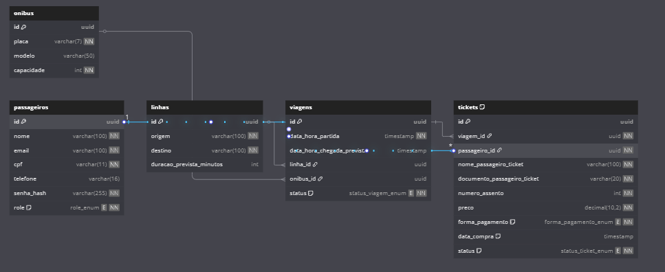
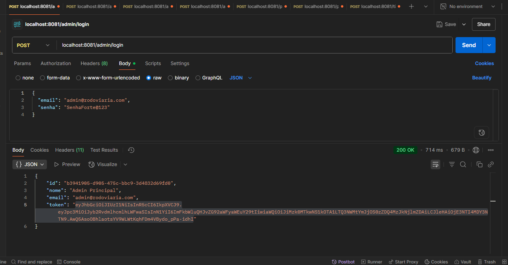
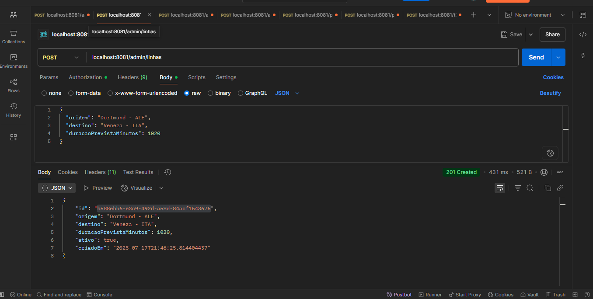
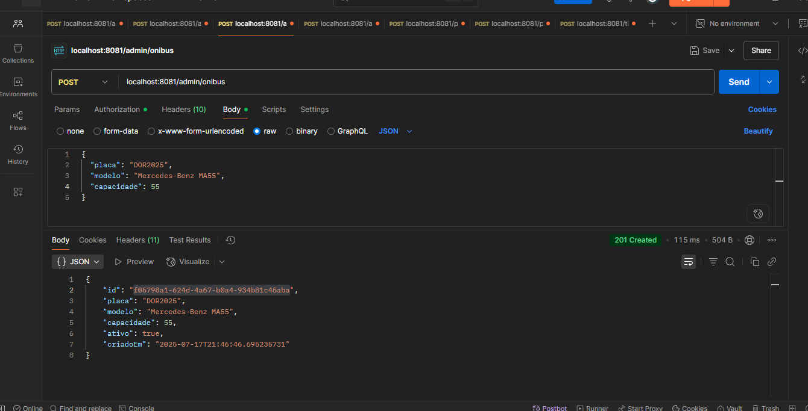
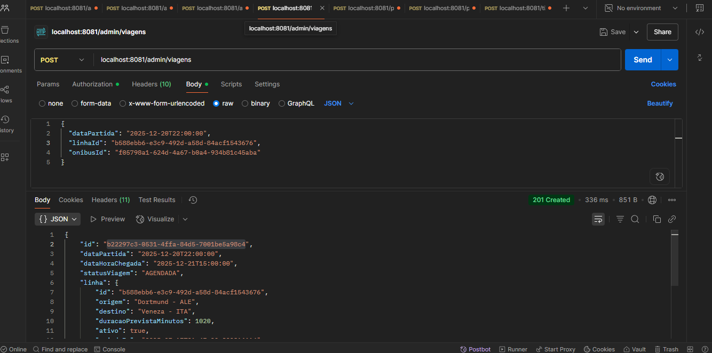
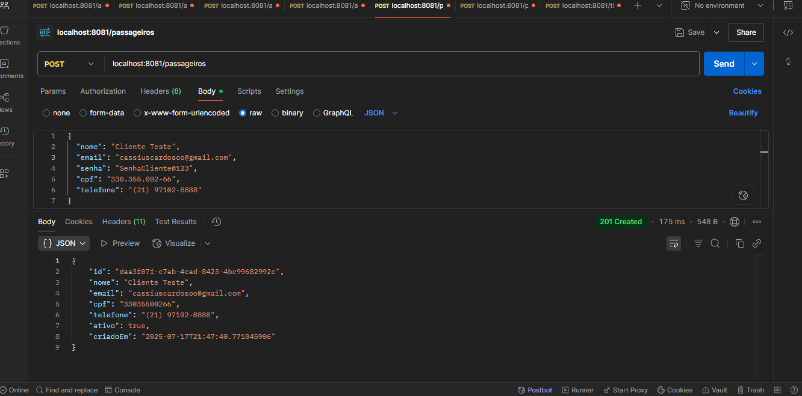
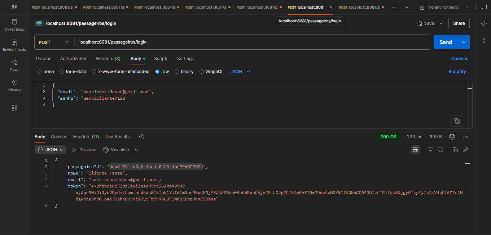
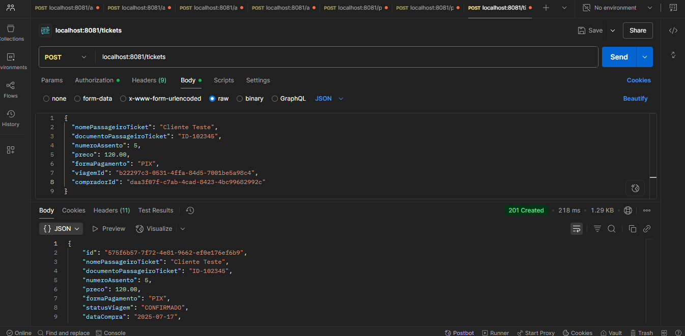
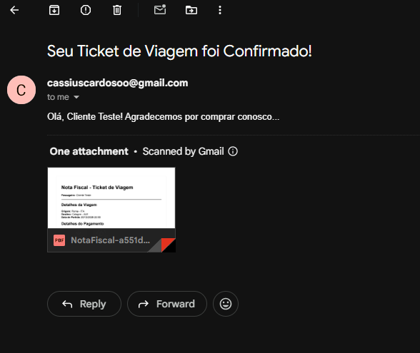
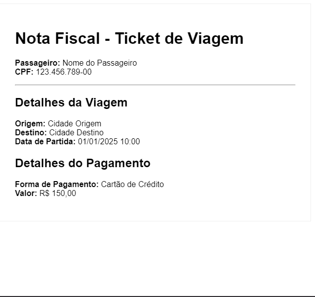

# 🏥 Sistema de Gerenciamento de Rodoviária

## 📄 Descrição
Projeto com uma API RESTful desenvolvida com Java 17 e Clean Architecture:

Permite manipular 5 tipos de entidades (passageiros, linhas, ônibus, viagens, tickets), destrinchando entre
desde o agendamento de uma viagem, até a consulta por modelos de domínio ativos, por e-mail etc.

## ⚙️ Funcionalidades
- **Gerenciar portal**: Funcionalidade exclusivamente para ROLE: ADMIN. Tendo um controle total de entidades, podendo desativar, listar etc.
- **Autenticação e autorização**: Com o intuito de criar uma navegação segura, somente usuários autenticados receberam o acesso via JWT, para passageiros existentes.
- **Geração de documentos**: Nota fiscal emitida por meio de um PDF, enviado ao e-mail do passageiro no momento da compra do ticket.
- **Segurança e reutilidade**: Todas entidades ao deixarem de existir, serão desativadas, não excluídas, para fins de segurança e comprovação.

## 🛠️ Tecnologias
- **Linguagem**: Java (versão 17)
- **Framework**: Spring Boot
- **Gerenciador de Dependências**: Maven
- **Banco de Dados**: PostgreSQL, H2, TestContainers
- **Persistência**: Spring Data JPA, Hibernate
- **Segurança**: Spring Security, JWT Token
- **Mensageria**: RabbitMQ
- **Testes**: JUnit, Mockito
- **Ulitários**: MapStruct
- **Documentação da API**: Swagger (Open API)
- **Container**: Docker, Docker compose

---
➡️ Fluxo da Aplicação:
!! NOTA !!
- Por ser um sistema sensível, muitas funcionalidades são exclusivas para ADMINISTRADORES, permitindo, que usuários 'comuns' tenham acesso a uma variedade menor

1. Usuário é criado com a ROLE user, permitindo acesso aos endpoints básicos.
2. Cria seu perfil de passageiro, com e-mail, cpf, senha, nome, telefone.
3. Já com acesso ao Token JWT, pode navegar entre endpoints de criar ticket, por exemplo.
4. Após requisitar o seu ticket, um e-mail de confirmação anexando um PDF da Nota Fiscal lhe será enviado, conforme o e-mail cadastrado.

---

## 📝 Endpoints


---

## 📈 Diagrama

<details>
    <summary><b>Diagrama de Classes</b></summary>
    
</details>

---

## 🗂️ Imagens do Projeto

<details>
  <summary><b>Autenticar admin</b></summary>
  
</details>

<details>
  <summary><b>Criação de uma linha</b></summary>
  
</details>

<details>
  <summary><b>Criação de ônibus</b></summary>
  
</details>

<details>
  <summary><b>Criação de uma viagem</b></summary>
  
</details>

<details>
  <summary><b>Criação de um passageiro</b></summary>
  
</details>

<details>
  <summary><b>Login de um passageiro</b></summary>
  
</details>

<details>
  <summary><b>Criação de um ticket</b></summary>
  
</details>

<details>
  <summary><b>Notificação e-mail</b></summary>
  
</details>

<details>
  <summary><b>Nota fiscal</b></summary>
  
</details>


---

## ⚙️ Configuração e Execução

**Pré-requisitos**:

- Java 17
- Maven
- PostgreSQL
- RabbitMQ (CloudAMQP)
- Docker

## 🚀 Passos para Configuração

1. Clone o repositório
````bash
git clone https://github.com/seu-usuario/spring-clean-arch.git
cd spring-clean-arch
````
2. Configure as variáveis de ambiente
```bash
# No Windows (usando PowerShell)
copy .env.example .env

# No Linux ou MacOS
cp .env.example .env
```
3. Suba os contêineres com docker compose
```bash
docker-compose up --build
```
## 🏗️ Estrutura do Projeto 

**Clean Architecture fornece, sobretudo, um desacoplamento maior do framework para as camadas. Por isso, explicar brevemente o comportamento de cada uma das camadas é essencial.**

- **Domain**: Contém as entidades de negócio, regras de domínio e exceções. É o núcleo da aplicação e não depende de nenhuma outra camada.
- **Application**: Orquestra o fluxo de dados, contém os casos de uso (Use Cases) e as interfaces dos gateways (portas).
- **Infrastructure**: Camada mais externa. Contém as implementações concretas de tudo que é definido nas outras camadas, como controllers, repositórios JPA, adaptadores de serviços externos e configurações do Spring.

---

## 🪄  Testes unitários
- **Testes com JUnit e Mockito**: 106 testes compreendendo todos os serviços.
```bash
mvn test
```
